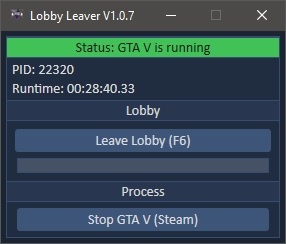

## Screenshots

# Description - [Latest Release](https://github.com/alweg/GTAV_Lobby_Leaver/releases/)
This tool lets you leave any Lobby you're currently in.

# Usage
Press F6 or click the 'Leave Lobby' button, wait a few seconds and you're alone in your current Lobby :)

## Notes
No you cannot become banned for using this tool. There's no reads no writes in the game's process happening.

## Libraries used
* [Costura](https://github.com/Fody/Costura)
* [Newtonsoft.Json](https://github.com/JamesNK/Newtonsoft.Json)

## Releases
https://github.com/alweg/GTA-V-Lobby-Leaver/releases
